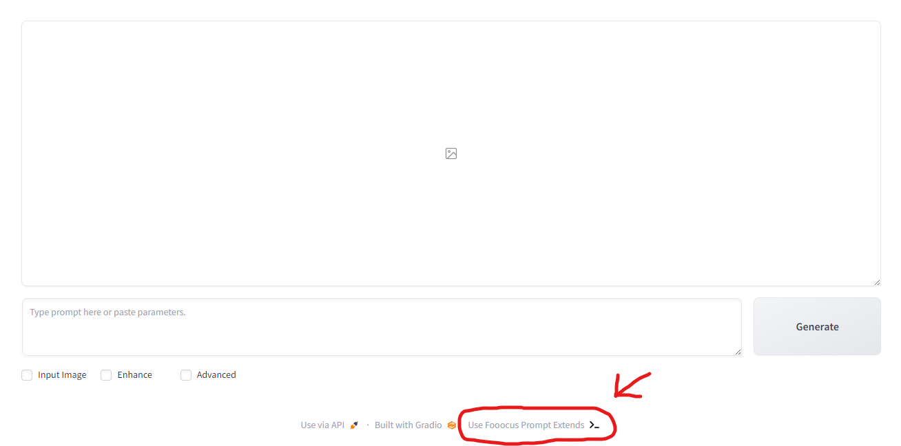
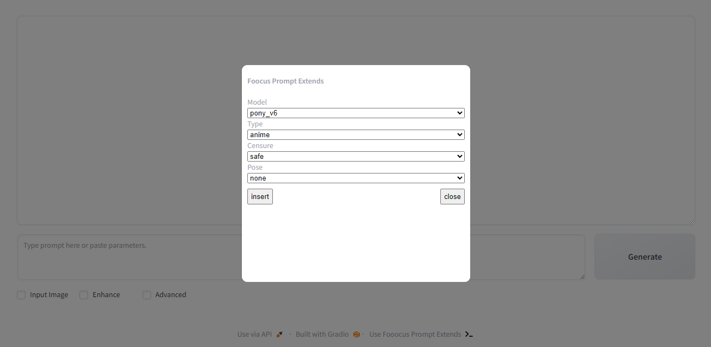
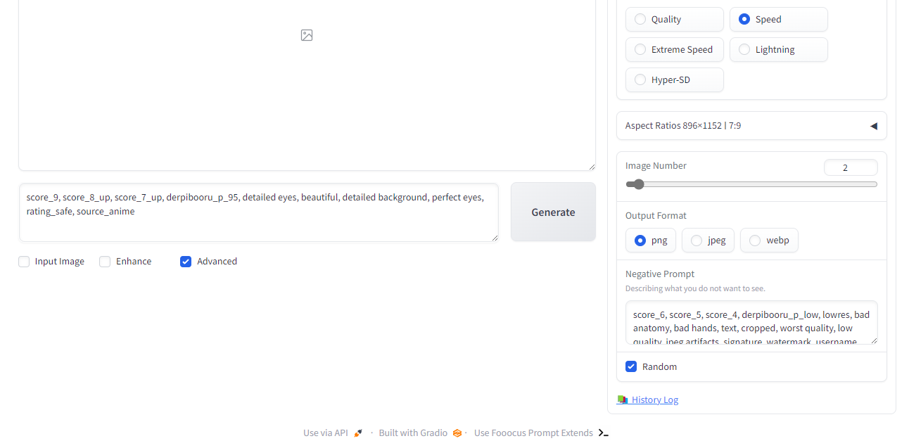

## Fooocus Prompt Extends

This extension was created to add the functionality to fooocus to auto-configure prompts and other features from more user-friendly options, avoiding having to copy and paste every time you need it. For now it only supports the pony_v6 model, but later it will support other models. Any help would be appreciated :smile:

## Getting Started

The first thing is to have fooocus installed, for this you can visit its [official github](https://github.com/lllyasviel/Fooocus)

to run the [development server](https://docs.plasmo.com/framework/workflows/dev):

```bash
pnpm dev
# or
npm run dev
```

or [build to production](https://docs.plasmo.com/framework/workflows/build):

```bash
pnpm build
# or
npm run build
```

To use the extension, open a browser and follow the steps in the [following article](https://learn.microsoft.com/en-us/microsoft-edge/extensions-chromium/getting-started/extension-sideloading), using the extension at the address build/chrome-mv3-prod

## How does it work?

This extension adds the "Use Fooocus Prompt Extends" button in the footer



When you click on it, a modal appears with different configurations



Each configuration allows you to add variables to the prompt to obtain different results:

### Model:
    - pony_v6: Pony Diffusion V6 is a versatile SDXL finetune capable of producing stunning SFW and NSFW visuals of various anthro, feral, or humanoids species and their interactions based on simple natural language prompts.
### Type: 
    - anime: The image features anime style
    - anime advance: Similar to anime but with a little more detail
    - pony: The image features pony style
    - furry: The image features furry style
    - cartoon: The image features cartoon style
    - realistic 1: The image features realistic style
    - realistic 2: The image features realistic style
### Censure:
    - safe: Safe content
    - questionable: Questionable content
    - explicit: Explicit content
### Pose: 
    - none: No pose
    - from below: Pose from below
    - from above: Pose from above
    - from side: Pose from side
    - close up: Close up
    - upper body: Upper body
    - portrait: Portrait
    - contrapposto: Contrapposto
    - full body: Full body

Once you have your configuration, by clicking on "insert", all the necessary configurations will be added both in prompt and in negative prompt.



All that remains is to write what you want to do. You can play around by changing the settings both from options and in the prompt itself.